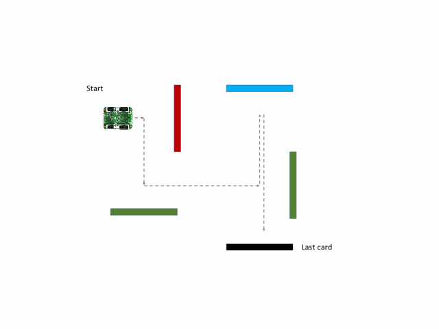

# Mine Navigation Search and Rescue

### Brief
Scenario:
Operations are currently underway to map an abandoned mine for safety and possible future use. A team of workers has gone into the mine as a part of initial exploration. One member of the team became separated from others and is currently missing. All explorers were asked to lay flags at certain distances on their path of travel inside the mine. It is too dangerous to send another person to look in the region where the explorer has been separated. Furthermore, the communications in the abandoned mine are too unstable for a robot to be remote controlled to look for the separated explorer. 

Your task is to design a control system for an autonomous robot to locate the flags laid by the explorer and find where they are located. The robot must then return to its original location with a full trace of its route such that a larger robot or, if necessary, manned team, can locate and extract the explorer.

This robot must be able to perform the following: 

1. Navigate towards a coloured card and stop before impacting the card
2. Read the card colour
3. Interpret the card colour using a predefined code and perform the navigation instruction
4. When the final card is reached, navigate back to the starting position
5. Handle exceptions and return back to the starting position if final card cannot be found

### "Mine" environment specification

A "mine" is contstructed from black plywood walls 100mm high with some walls having coloured cards located on the sides of the maze to assist with navigation. The following colour code is to be used for navigation:

Colour | Instruction
---------|---------
Red | Turn Right 90
Green | Turn Left 90
Blue | Turn 180
Yellow | Reverse 1 square and turn right 90
Pink | Reverse 1 square and turn left 90
Orange | Turn Right 135
Light blue | Turn Left 135 
White | Finish (return home)
Black | Maze wall colour

Mine courses will vary in difficulty, with the simplest requiring 4 basic moves to navigate. More advanced courses may require 10 or moves to navigate. The mines may have features such as dead ends but colour cards will always direct you to the end of the maze. Once the end of the maze has been reached, you must return to the starting position. An example course to navigate is shown below. You do not know in advance which colours will be in the course or how many.

## Our solution

To start the program within the maze, the RF2 button should be pressed when the buggy is in the appropriate position and is ready to start the program. Once the button is pressed, the buggy will move forward, recording the time taken, continuously reading the clear sensor reading until the clear sensor reads a reading above a certain threshold. This triggers the sequence of commands that stores the time taken to reach the card, reads the card in front of the buggy and responds appropriately, and then storing the card read in the aforementioned array. The buggy then repeats the steps until the white card is read. Then it enters the ReturnHome sequence, whithin which it turns around and iterates through the array, moving forward for the time stored, and executing the opposite commands to those corresponding to the stored cards.

### Colour detection and response methodology

The robot is initiated with a calibration routine in which it fills an 4 by 9 array with the expected readings for each colour sensor (RGBC) for each colour card. Prompted by a button press, the buggy collects 3 data values for each colour sensor and calculates the average for each. The coloured cards follow the calibration sequence: red, green, blue, yellow, pink, orange, light blue, white and black, and the RF2 button input is used to trigger the next card being read. 
After all of the cards is read, there is one background reading of the clear sensor; this is used to determine the threshold value above which the card-reading sequence is initialised. 

Note that during calibration the card should be pushed up against the front of the buggy when the button is pressed - the buggy will then automatically move itself to the location where accuracy of reading is greatest, determined experimentally.

To start, variables are created for each of the colour sensors, named red_read, green_read and blue_read, and these are often used to temporarily store the readings of the ColorClick before they are stored elsewhere. An array called expected_values is also created, and this is filled up with the values obtained from each of the colour sensors during the calibration sequence. For example, the first column of the array contains the expected red, green and blue readings for a red card. In the main while loop, a clear reading is constantly made, and if this exceeds a predetermined threshold the card reponse sequence is triggered. During this, the readings of the detected card are compared to the expected values for each calibrated card, and whichever card has the values which are closest to those in the new reading is predicted to be the card in front of the buggy. This is then used to execute the appropriate response.

### Returning home methodology

The main function introduces two arrays, one that holds the time counted by the timer interrupt between cards ReturnHomeTimes, and the other that holds the cards seen on the journey of the buggy, ReturnHomeCards. 
A timer is written that overflows every 1/10 second, and the number of times it overflows is counted in the main (where the while loop iterates constantly and therefore is incrementing the timercount every time it detects an overflow), until the buggy detects a card in front of it, therefore counting the time that the buggy moved forward. The buggy then responds to the colour of the card and records the card in the array. As the buggy moves through the maze, both arrays are filled with the time taken to get to each card, and what card it saw. 
Once the buggy detects a white card, this initiates the return home sequence. The buggy turns around 180 degrees and iterates through the array backwards (skipping past any empty elements). The buggy starts moving forward for the time dictated in the last filled element of the array, and when it stops it carries out the appropriate home response function (i.e. the inverse of the original commands). It then moves to the penultimate element, moves forward for that time and repeats this process until the buggy returns to the start.

Note that the ReturnHomeTimes stores the time taken to reach the ReturnHomeCards value of the same index. This means that when the return home function is called (ie the white card is detected), it first reads the most recent time, then lowers the index by one, then responds to the card of that index, then responds to the timer of that index, then lowers the index by one, etc...

## Key Program Files

### Main
Here the initiation functions are called, the DC motor structure is defined, and key variables are created. It then runs the calibration sequence that stores the expected values for each colour card. Then in the continuous while loop the Timer interrupt flag is used to increment the timer, and it is checked whether the clear reading indicates a card in front of the buggy. If this is detected then the response to the card is executed. 

### i2c
Here are the key functions required for the I2C communication.

### Color
This file contains the I2C communication necessary to receive values from the RGBC sensors. 

### LEDsOn
This file initiates all the lights on the buggy, namely the car lights(e.g. brake lights and headlamps), and the colour click tri-color illumination.

### dc_motor
Here the DC motor functions for basic movements (forward, backwards, left and right) are defined, with the turns done in 45 degree increments.

### colour_identify
This file contains all the functions detailed in the colour detection and response methodology section, i.e. collect_avg_readings, normalise_readings, make_master_closeness, determine_card, motor_response, and the overarching function, card_response. It also contains the function home_response which contains the appropriate actions to return home.

Details of these functions are given below:

1: collect_avg_readings: Takes 500 readings (overwriting each other) before storing 3 readings and averaging those. This is done for clear, red, blue, and green colour sensor. During testing, it was discovered that the final 3 saved readings were closer in magnitude if there were several readings before it, hence the 500 unsaved readings.

2: normalise readings: This function takes the collected readings, finds the difference between these readings and the expected for each colour of each possible card, divides by the expected value and stores it in the array normalised_values.

3: make_master_closeness: This short function finds the difference between the normalised values and the expected values of each card.

4: determine_card: parses through the master_closeness array and finds the smallest value (hence corresponding to the colour which the reading is most like)

5: motor_Response: Takes the predicted card and executes the response specified in the brief. 
	

### serial
This file contains the necessary functions to utilise the serial communication to view the colour sensor readings and for debugging purposes.

### Videos
The video of the buggy running the test maze is found here: https://youtu.be/ieVXnOMHYYI
The video of the buggy running the easy maze is found here: https://youtube.com/shorts/kAJKZJEhZO8?feature=share
The video of the buggy running the hard maze is found here: https://youtu.be/YRGQFnze7Yo
